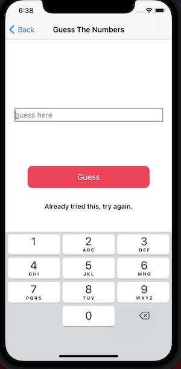

# GuessTheNumberCombination-iOS
LinkedIn coding challenge.

## Build and Runtime Requirements
+ Xcode 6.0 or later
+ iOS 8.0 or later (preferably 11 pro)
+ OS X v10.10 or later
+ 
### Common setup
Clone the repo and install the dependencies.


## Description 
This is a game where a player tries to guess the number combinations. At the end of each
attempt to guess the 4 number combinations, the computer will provide feedback whether the
player had guess a number correctly, or/and a number and digit correctly. A player must guess
the right number combinations within 10 attempts to win the game.

## ScreenShot

 


## Code snippet of a challenging part of app

```swift
  struct get {
        let result: (()-> String?)
        init(total: Int, min: Int, max: Int){
            let url = "https://www.random.org/integers/?num=\(total)&min=\(min)&max=\(max)&col=1&base=10&format=plain&rnd=new"
            result = {
                do {
                    let data = try Data(contentsOf: URL(string: url)!)
                    let result = String(data: data, encoding: .utf8)!.components(separatedBy: "\n").joined()
                    return result
                } catch {
                    return nil
                }
            }
        }
    }
  ```
  
### APIs
https://www.random.org/clients/http/api/
